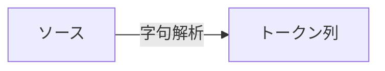
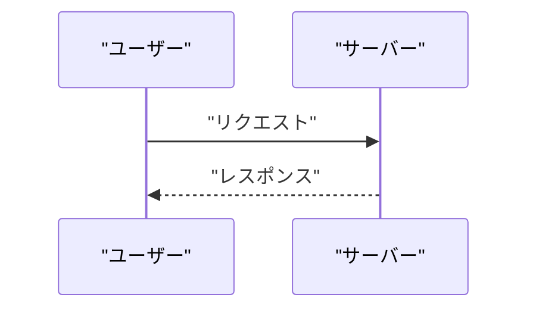
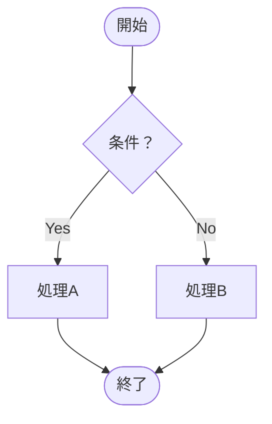
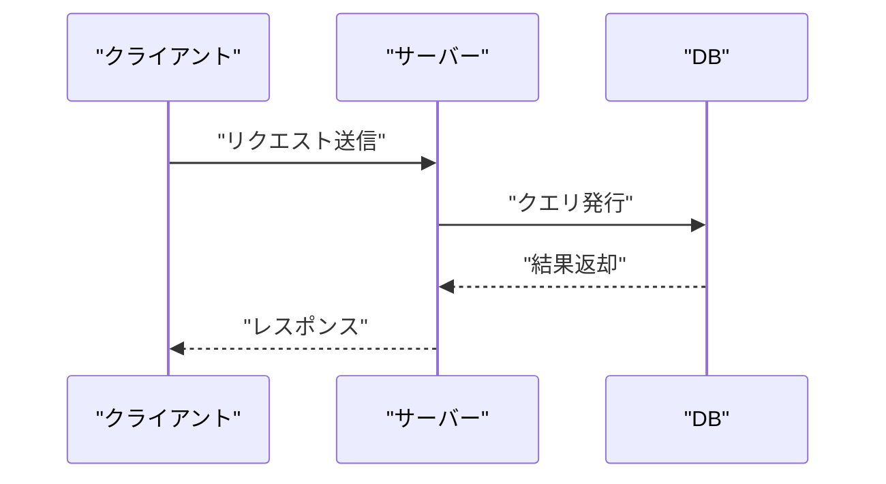
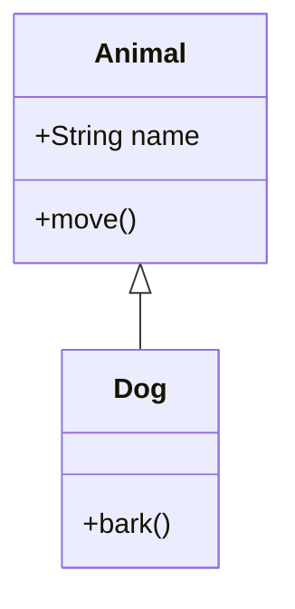
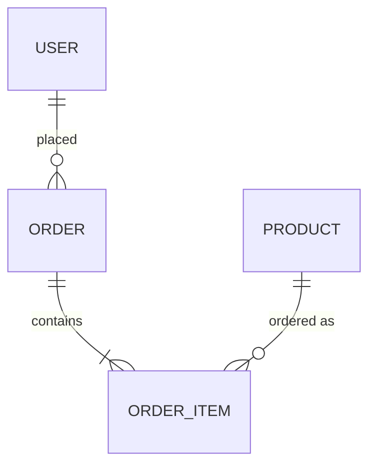
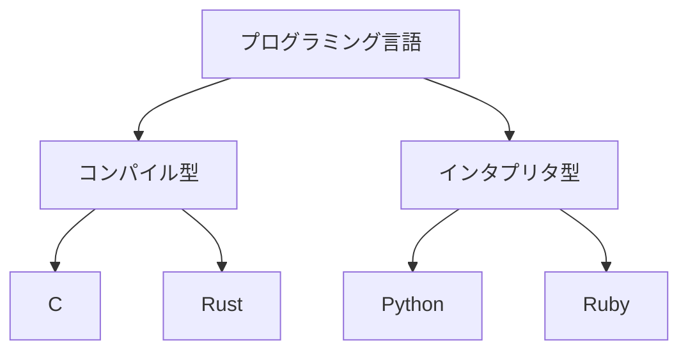
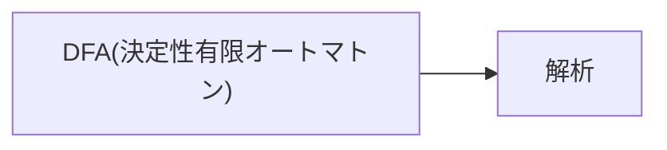

# mermaid 使用ガイド

Issue は GitHub 上で mermaid コードブロックを**ネイティブレンダリング**するため、フロー・構造を伴う説明は mermaid で積極的に図示する。Marp（class-slides）と違い「Viewer にコピペ」の案内は不要で、学生は Issue を開くだけで図を見られる。

## 目次

1. [mermaid を使う場面](#mermaid-を使う場面)
2. [mermaid を使わない場面](#mermaid-を使わない場面)
3. [GitHub での互換性](#github-での互換性)
4. [日本語ラベルの扱い](#日本語ラベルの扱い)
5. [型別の記法テンプレート](#型別の記法テンプレート)
6. [失敗しやすいパターン](#失敗しやすいパターン)

---

## mermaid を使う場面

節の解説で以下の型に該当する内容が出てきたら、mermaid で図示する。文字だけで表現するより、視覚的に関係を示すほうが理解が早い領域。

| 型 | mermaid 種別 | 判定基準 |
|----|-------------|---------|
| フロー・手順 | `flowchart` | 2 ステップ以上の処理、判断分岐を含む |
| 時系列・対話 | `sequenceDiagram` | 2 以上のアクター間のメッセージやりとり |
| 状態変化 | `stateDiagram-v2` | 状態が 2 個以上、遷移に条件やイベントが関係する |
| 構造・関係 | `classDiagram` / `erDiagram` | クラス関係、エンティティの関連 |
| 分類・階層 | `graph TD` | 木構造、包含関係、カテゴリ分け |

1 つの節に複数の図を入れてよい。Issue は紙幅の制約がないため、フローと状態遷移を両方示したいならどちらも入れる。

---

## mermaid を使わない場面

以下は mermaid にすると返って読みにくい。通常の Markdown で表現する:

| 内容 | 推奨形式 | 理由 |
|------|---------|------|
| 比較（A と B の違い） | Markdown 表 | 表のほうが一覧性が高く、セル単位で参照しやすい |
| 数値・割合（構成比・成績分布） | テキストまたは表 | mermaid の pie chart は授業資料として過剰、細かい数値が読みにくい |
| 単なる箇条書きで足りる列挙 | 箇条書き | 図にしても情報量が増えない |
| 2〜3 要素しかない平易な関係 | 文章 | `A → B` のような関係はインライン記号で十分 |

「何でも図にしない」ことが大事。図示の価値は「文字では関係が掴みにくい構造を一目で見せること」にある。

---

## GitHub での互換性

GitHub は **Mermaid v10 系**をネイティブサポートする。以下を守る:

- **公式ドキュメントの記法**に沿う（v8 以前の古い記法や v11 の先取り記法は避ける）
- `flowchart` と `graph` はどちらも使えるが、新規は `flowchart` を推奨（公式の方向性に合わせる）
- `stateDiagram-v2` を使う（`stateDiagram` v1 は非推奨）
- GitHub の mermaid レンダラは**コードブロックの言語指定が `mermaid` でなければ動かない**。`mmd` 等ではレンダリングされない

```markdown

```

---

## 日本語ラベルの扱い

**日本語を含むノードラベルは必ず `"` で囲む**。囲まないと mermaid パーサがスペースや括弧を区切り文字と誤認してエラーになる。

**正しい例:**


**間違った例（パースエラー）:**


エッジラベル（矢印の上の文字）も同様に囲む:



シーケンス図の参加者名にも適用する:



---

## 型別の記法テンプレート

### flowchart



- `TD` = 上から下、`LR` = 左から右。情報の流れに合わせて選ぶ
- 判断ノードは `{"..."}`（ひし形）、開始・終了は `(["..."])`（丸角）、通常処理は `["..."]`（四角）

### sequenceDiagram



- `->>` = 同期メッセージ、`-->>` = 応答・非同期
- ライフラインは自動的に縦線として描画される

### stateDiagram-v2

```mermaid
stateDiagram-v2
    [*] --> "未ログイン"
    "未ログイン" --> "ログイン済み": "認証成功"
    "ログイン済み" --> "未ログイン": "ログアウト"
    "ログイン済み" --> [*]: "退会"
```

- `[*]` は開始・終了状態を示す
- 遷移条件は `:` の後にラベル

### classDiagram



### erDiagram



### graph TD（分類・階層）



---

## 失敗しやすいパターン

### 1. ノード ID に記号や日本語が入っている

mermaid は `[ラベル]` の前の識別子を ID として扱う。ID は英数字とアンダースコアに限定すべき:

**悪い例:**


**良い例:**


### 2. 括弧のエスケープ忘れ

日本語ラベルに `()` が含まれる場合、ダブルクォートで囲めば問題ないが、クォートなしだと解釈エラーになる:

**良い例:**


### 3. コロンの多用によるパースエラー

エッジラベルでコロンを使うとき、ダブルクォートで囲まないと区切り文字と誤認される:

**悪い例:**
```
A -->|ステップ1: 準備| B
```

**良い例:**
```
A -->|"ステップ1: 準備"| B
```

### 4. 複雑すぎる図

ノードが 20 個以上になる場合は、図を分割するか、箇条書きと組み合わせて段階的に説明する。1 枚の図に情報を詰め込んでも学生は読み切れない。
